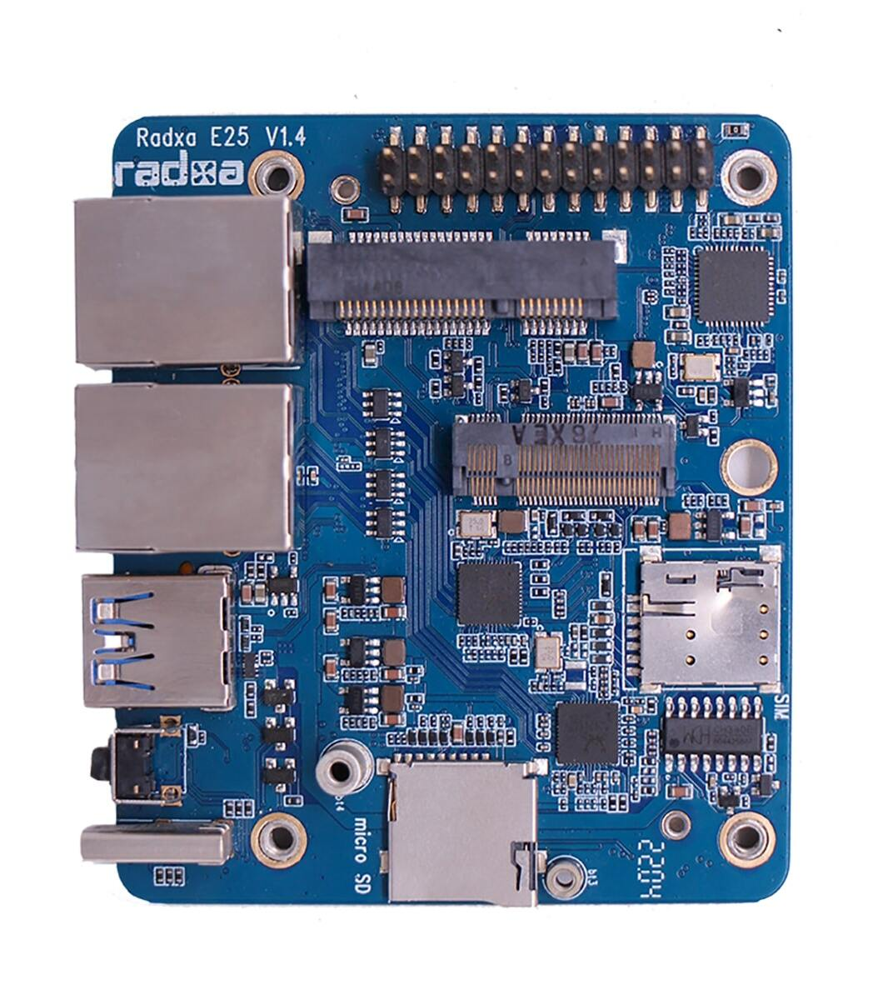

.. |yes| image:: ../../images/yes.png
.. |no| image:: ../../images/no.png

.. role:: underline
   :class: underline

RADXA E25
=====================

+----------------+-----------------+
| System on Chip | Rockchip 356x   |
+----------------+-----------------+
| Number GPIO    |  17             |
+----------------+-----------------+
| Status         |  Fully supported|
+----------------+-----------------+

Supported Features
------------------

+----------------+-----------------+
| Read / Write   | |yes|           |
+----------------+-----------------+
| Interrupt      | |yes|           |
+----------------+-----------------+

GPIO Mapping
------------

+----+----+----+----+----+---+----+---+---+----+----+----+----+
| 5v | 5v | 0v | 15 | 16 | 1 | 0v | 4 | 5 | 0v |3.3v| 10 | 11 |
+----+----+----+----+----+---+----+---+---+----+----+----+----+
|3.3v| 8  | 9  | 7  | 0v | 0 | 2  | 3 | 6 | 12 | 13 | 14 | 0v |
+----+----+----+----+----+---+----+---+----+----+----+----+---+
